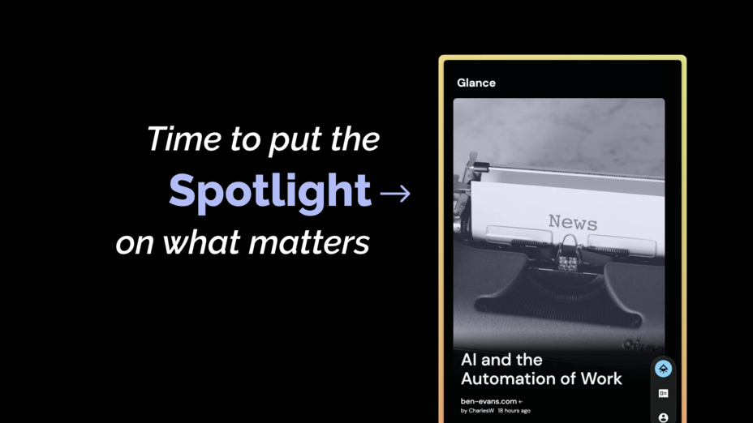
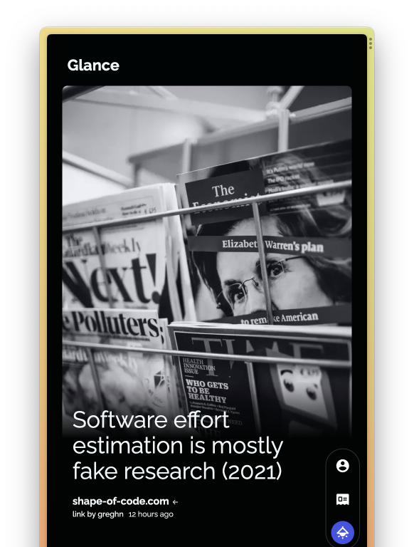
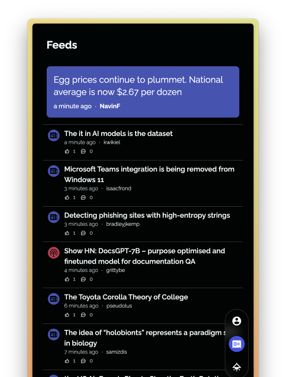

# Spotlight

[Spotlight](https://spotlight.d-exclaimation.me) is a modern take for news consumption. We are building a news platform that is fast, reliable, and most importantly, relevant to you.

## Features

**Glance** - a clutter-free, easy to read news feed that you can swipe through.

**Feeds** - a optimised for speed collection of news articles, so you can get the latest news in a jiffy.

**Dashboard** - a one stop place to view all your activities and preferences

## Community & Support

- [GitHub Issues](https://github.com/d-exclaimation/spotlight/issues). Best for: bugs and errors you encounter using [Spotlight](https://spotlight/d-exclaimation.me).
- [Email Support](mailto:vincent@d-exclaimation.me). Best for: problems with your account.

## Status
 
- [x] Alpha: We are testing Spotlight with a closed set of customers
- [x] Early access: Anyone can sign up to a waitlist and get early access, but most features are still being built
- [x] Public Beta: Available for everyone with stable feature set, but we are still working out kinks
- [ ] Public: General Availability 

We are currently in Public Beta.

## License

Spotlight is licensed under the [MPL-2.0](/LICENSE) license.

## Acknowledgements

Special thanks to these amazing projects which help power Spotlight:

- [Vercel](https://vercel.com) for hosting the frontend and edge functions
- [Railway](https://railway.app) for hosting the backend and database
- [SvelteKit](https://kit.svelte.dev) for the frontend framework
- [tRPC](https://trpc.io) for the backend framework

 

Have fun, 
Friends at Spotlight
  
 

[Spotlight](https://spotlight.d-exclaimation.me) 
<small>Browsing news streamlined</small>
